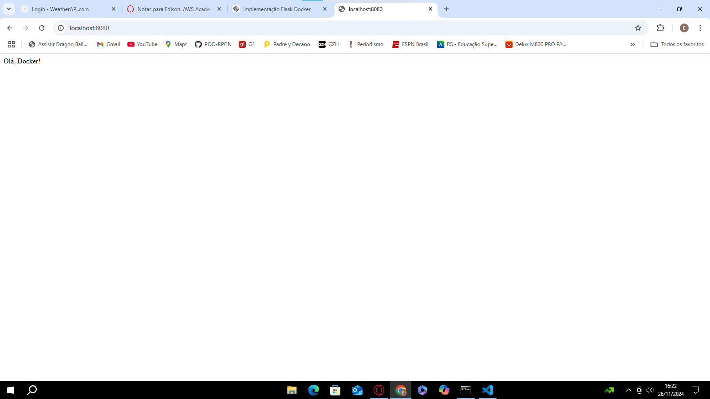

# Flask com Docker - Trabalho Prático

Este projeto implementa uma aplicação web simples utilizando **Flask** e a contêineriza com **Docker**. O objetivo é demonstrar os conceitos de criação, configuração e execução de uma aplicação dentro de um contêiner.

---

## Sumário
1. [Descrição do Projeto](#descrição-do-projeto)
2. [Pré-requisitos](#pré-requisitos)
3. [Como Executar Localmente](#como-executar-localmente)
4. [Docker: Construção e Execução](#docker-construção-e-execução)
5. [Estrutura do Projeto](#estrutura-do-projeto)
6. [Comandos Utilizados](#comandos-utilizados)
7. [Captura de Tela](#captura-de-tela)
8. [Contribuição](#contribuição)

---

## Descrição do Projeto

Esta é uma aplicação web escrita em **Python** usando **Flask**. A aplicação retorna a mensagem:


ao acessar a rota principal (`/`).

A aplicação foi contêinerizada com **Docker** para garantir a portabilidade e facilitar o deploy.

---

## Pré-requisitos

Antes de executar o projeto, instale:

- [Python 3.9 ou superior](https://www.python.org/)
- [Docker Desktop](https://www.docker.com/products/docker-desktop) para Windows

---

## Como Executar Localmente

Siga os passos abaixo para executar a aplicação em sua máquina:

1. Clone este repositório:
   ```bash
   git clone https://github.com/seu-usuario/flask-docker-app.git
   cd flask-docker-app

Crie e ative um ambiente virtual:

bash
Copiar código
python -m venv venv
venv\Scripts\activate
Instale as dependências da aplicação:

bash
Copiar código
pip install -r requirements.txt
Execute a aplicação localmente:

bash
Copiar código
python app.py
Abra o navegador e acesse: http://localhost:8080.

Docker: Construção e Execução
Construir a Imagem Docker
Para construir a imagem Docker da aplicação, execute o seguinte comando no diretório do projeto:

bash
Copiar código
docker build -t flask-docker-app .
Executar o Contêiner
Após construir a imagem, inicie o contêiner com o comando:

bash
Copiar código
docker run -d -p 8080:8080 flask-docker-app
-d: Executa o contêiner em segundo plano.
-p 8080:8080: Mapeia a porta 8080 do contêiner para a porta 8080 da máquina host.
Acessar a Aplicação
Abra o navegador e acesse: http://localhost:8080. Você verá a mensagem:

arduino
Copiar código
"Olá, Docker!"
Estrutura do Projeto
A estrutura de arquivos do projeto é a seguinte:

bash
Copiar código
flask-docker-app/
├── app.py                # Código principal da aplicação Flask
├── requirements.txt      # Dependências da aplicação
├── Dockerfile            # Arquivo de configuração para contêiner Docker
└── README.md             # Documentação do projeto
Comandos Utilizados
Python e Flask
Criar e ativar o ambiente virtual:

bash
Copiar código
python -m venv venv
venv\Scripts\activate
Instalar as dependências:

bash
Copiar código
pip install Flask
pip freeze > requirements.txt
Executar a aplicação localmente:

bash
Copiar código
python app.py
Docker
Construir a imagem Docker:

bash
Copiar código
docker build -t flask-docker-app .
Executar o contêiner:

bash
Copiar código
docker run -d -p 8080:8080 flask-docker-app
Listar imagens Docker:

bash
Copiar código
docker images
Limpar contêineres parados:

bash
Copiar código
docker container prune

Captura de Tela



Contribuição
Este projeto foi desenvolvido como parte do trabalho prático da disciplina Computação em Nuvem, ministrada pelo professor Augusto da Rosa Muniz (GutoMuniz) no Centro Universitário UNISENAC Pelotas.